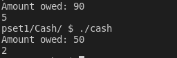

# pset1

## This problem set mostly focuses on the complete basics of C, its useful functions and the way to play around and give simple user input

## This README will explain the goals of each problem

### Cash:
#### Calculate the amount of coins a customer should recieve based on how many cents they choose in user input

### Credit:
#### Validate a credit card using IBM's mastermind `Hans Peter Luhn`'s algorithm

### Hello:
#### Greet user by asking them what their name is and outputting "Hello, `name`"

### Mario_Less:
> Make a pyramid of a specified height between 1 and 8 similar to `Super Mario Bros`.'s flag jump. Like the following:

### Mario_More:
#### Make a pyramid of a specified height between 1 and 8 similar to `Super Mario Bros`.'s 1-1 level's jump. Like the following:

