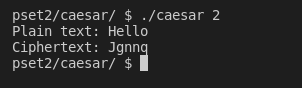

# pset2

## This problem set mostly focuses on working with arrays and ASCII manipulation in order to create things like the caesar cipher in C

## This README will explain the goals of each problem

### Caesar:
#### Use ASCII characters to create the [caesar cipher](https://en.wikipedia.org/wiki/Caesar_cipher)

### Readability:
#### Get the index (grade level) of a specific text provided by the user which gives a number to which grade level a reader should read that text in (e.g. Grade 9, Grade 1, Before Grade 1)

### Scrabble:
#### Create the [scrabble](https://en.wikipedia.org/wiki/Scrabble) game which prompts two players for text and gives a score to each player and whoever gets the higher score wins
[Scrabble](../screenshots/scrabble.png)

### Substitution:
#### Use ASCII characters to make a higher-up version of the caesar cipher in which a user gives a key as an argument and enters the plain text, and what gets outputted is the plain text characters swapped with its alphabetical characters in the key provided by the user
[Substitution](../screenshots/substitution.png)

### Wordle:
#### Create the [wordle](https://www.nytimes.com/games/wordle/index.html) game in which players guess a random 5-8 letter word
[Wordle](../screenshots/wordle.png)
