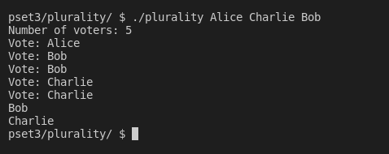
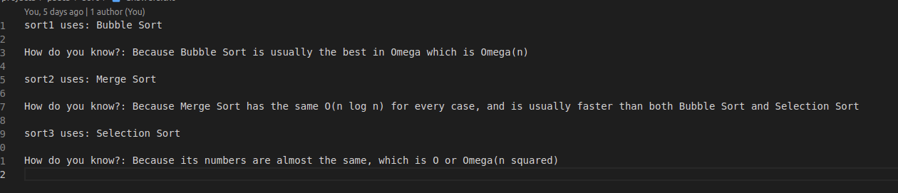
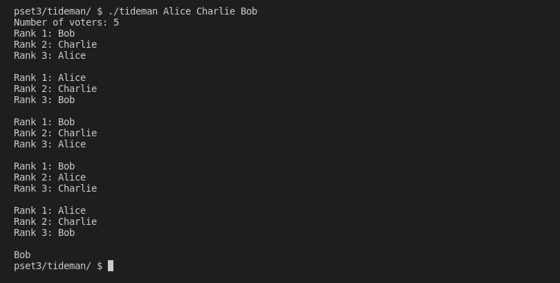

# pset3

## This problem set mostly focuses on algorithms/sorting algorithms

## This README will explain the goals for each problem

### [Plurality](./plurality/):
#### Create a [plurality](https://en.wikipedia.org/wiki/Plurality_voting) election which is basically just a system where the candidate with the most votes wins the election

### [Runoff](./runoff/):
#### Create a [runoff](https://en.wikipedia.org/wiki/Two-round_system) election
> ./runoff Alice Bob Charlie
> Number of voters: 5

> Rank 1: Alice

> Rank 2: Bob

> Rank 3: Charlie

> Rank 1: Alice

> Rank 2: Charlie

> Rank 3: Bob

> Rank 1: Bob

> Rank 2: Charlie

> Rank 3: Alice

> Rank 1: Bob

> Rank 2: Alice

> Rank 3: Charlie

> Rank 1: Charlie

> Rank 2: Alice

> Rank 3: Bob

> Alice
### [Sort](./sort/):
#### You're given 3 programs and you can't look at their source code, they use 3 sorting algorithms which are: Bubble Sort, Merge Sort, and Selection Sort and you have to identify them

### [Tideman](./tideman/):
#### Create a [tideman](https://en.wikipedia.org/wiki/Ranked_pairs) election

