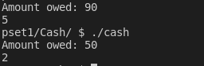
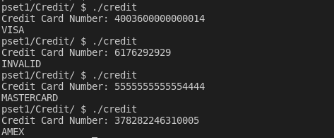
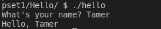
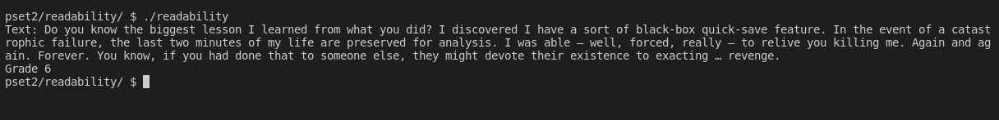

# pset6

## This problem set mostly focuses on building applications in Python

## This README will explain the goals of each problem

### [DNA](./dna/):
#### Compare DNA sequences with each othe

### [Cash](./sentimental-cash/):
#### Calculate the amount of coins a customer should recieve based on how many cents they choose in user input

### [Credit](./sentimental-credit/):
#### Validate a credit card using IBM's mastermind `Hans Peter Luhn`'s algorithm

### [Hello](./sentimental-hello/):
#### Greet user by asking them what their name is and outputting "Hello, `name`"

### [Mario (less comfortable)](./sentimental-mario-less/):
Make a pyramid of a specified height between 1 and 8 similar to `Super Mario Bros`.'s flag jump. Like the following:

### [Mario (more comfortable)](./sentimental-mario-more/):
#### Make a pyramid of a specified height between 1 and 8 similar to `Super Mario Bros`.'s 1-1 level's jump. Like the following:

### [Sentimental Readability](./sentimental-readability/):
#### Get the index (grade level) of a specific text provided by the user which gives a number to which grade level a reader should read that text in (e.g. Grade 9, Grade 1, Before Grade 1)

### [World Cup](./world-cup/):
#### Simulate multiple world cup tournaments and get the chances of each team winning